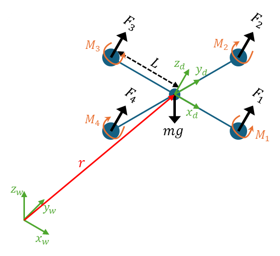

# Linear motor model approximation

Each rotor has an angular speed $\omega_i$ and produces a vertical force $F_i$ according to

$$
\begin{equation}
F_i = k_F \omega_i^2
\end{equation}
$$

The rotors also produce a moment according to

$$
\begin{equation}
M_i = k_M \omega_i^2
\end{equation}
$$

The results of a system-identification exercise suggest that the rotor speed is related to the commanded speed by a first-order differential equation

$$
\dot{\omega_i} = k_m(\omega_i^{des}-\omega_i)
$$

The constants, $k_F$, $k_M$ and $k_m$ were determined by experimentation with a fixed rotor at steady state.

---

# Body frame 3D
The frame modeling is analyzed from the figure bellow,



The vector $r$ is the rotation vector from the world origin to the center of mass of the body frame. The rotation is described using Z-X-Y Euler angles, then the matrix that describes the rotation is

$$
\begin{equation}
\R=\R_{\psi,y}\R_{\phi,x}\R_{\theta,y}
\end{equation}
$$

$$
\R=
\begin{bmatrix}
c\psi c\theta-s\phi s\psi s\theta & -c\phi s\psi & c\psi s\theta+c\theta s\phi s\psi\\
c\theta s\psi-c\psi s\phi s\theta & c\phi c\psi & s\psi s\theta-c\psi c\theta s\phi\\
-c\phi s\theta & s\phi & c\phi c\theta
\end{bmatrix}
$$

where $c\theta$ and $s\theta$ denote $\cos(\theta)$ and $\sin(\theta)$, respectively, similarly for $\phi$ and $\psi$.

Analyzing the forces on the system and applying the second Newton’s law on the world reference frame. It is possible, understand that the direction of the force of gravity is always in $-z_w$  and each force $F_i$ generated by each motor is apply in z-axis rotated respect the vector $r$.

$$
\mathbb{F}_T = m\ddot{\vec{r}}
$$

$$
\begin{equation}
m\ddot{\vec r} =
\begin{bmatrix}
0\\0\\-mg
\end{bmatrix} +
\R\begin{bmatrix}
0\\0\\\sum F_i
\end{bmatrix}
\end{equation}
$$

Now analyzing the rotational movement and defining the components of angular velocity of the robot body as $p$, $q$ and $r$. Which values are related to the derives of the roll, pitch and yaw angles according to

$$
\vec\omega_d=\begin{bmatrix}
p\\ q\\ r
\end{bmatrix}=\frac{d\R}{dt}
$$

## Rotation matrix derivation

To obtain the derivative of $\R$, we need to remember the equation (3) and apply the chain rule. Also is important understand that a homogeneous rotation matrix has some special properties and its derivative is defined as

$$
\frac{d\R_{\alpha,i}}{dt}=\R_{\alpha,i}^T\dot\R_{\alpha,i} \longmapsto
\dot\R_{\alpha,i}=\R_{\alpha,i}\mathbb{S}_i\dot\alpha
$$

where $\mathbb{S}_i$ is an antisymmetric matrix called "skew matrix”.

> Some homogeneous rotation matrix properties
>
> - $\R^{-1} = \R^T$
> - $\R\R^T = \R^T\R = I$
>
> Some skew matrix properties
> - $\R^T_n\mathbb{S(m)}\R_n = \mathbb{S}(\R^T\times m)$

Then, apply the chain rule of derivative,

$$
\dot\R=
\R_{\psi,y}\R_{\phi,x}\dot\R_{\theta,y}+
\R_{\psi,y}\dot\R_{\phi,x}\R_{\theta,y}+
\dot\R_{\psi,y}\R_{\phi,x}\R_{\theta,y}
$$

$$
\begin{split}
\dot\R = &\R_{\psi,y}\R_{\phi,x}(\R_{\theta,y}\mathbb{S}_j\dot\theta) +\\
& \R_{\psi,y}(\R_{\phi,x}\mathbb{S}_i\dot\phi)\R_{\theta,y} +\\
& (\R_{\psi,z}\mathbb{S}_k\dot\psi)\R_{\phi,x}\R_{\theta,y}
\end{split}
$$

Now, we multiply on right by $\R^T = \R_{\theta,y}^T\R_{\phi,x}^T\R_{\psi,z}^T$,

$$
\begin{split}
\R^T\dot\R = &(\R_{\theta,y}^T\R_{\phi,x}^T\R_{\psi,z}^T)\R_{\psi,y}\R_{\phi,x}(\R_{\theta,y}\mathbb{S}_j\dot\theta) +\\
& (\R_{\theta,y}^T\R_{\phi,x}^T\R_{\psi,z}^T)\R_{\psi,y}(\R_{\phi,x}\mathbb{S}_i\dot\phi)\R_{\theta,y} +\\
& (\R_{\theta,y}^T\R_{\phi,x}^T\R_{\psi,z}^T)(\R_{\psi,z}\mathbb{S}_k\dot\psi)\R_{\phi,x}\R_{\theta,y}
\end{split}
$$

$$
\begin{split}
\R^T\dot\R =
& \mathbb{S}_j\dot\theta +\\
& \R_{\theta,y}^T\mathbb{S}_i\R_{\theta,y}\dot\phi +\\
& \R_{\theta,y}^T\R_{\phi,x}^T\mathbb{S}_k\R_{\phi,x}\R_{\theta,y}\dot\psi
\end{split}
$$

$$
\begin{split}
\R^T\dot\R =
& \mathbb{S}_j\dot\theta +\\
& \mathbb{S}(\R_{\theta,y}^T\times i)\dot\phi +\\
& \mathbb{S}(\R_{\theta,y}^T\R_{\phi,x}^T\times k)\dot\psi
\end{split}
$$

Where $i^T=[1, 0, 0]$, $j^T=[0, 1, 0]$ and $k^T=[0, 0, 1]$. Rewite and organize the therms,

$$
\begin{split}
\R^T\dot\R & =
\mathbb{S}(\R_{\theta,y}^T\times i)\dot\phi +
\mathbb{S}_j\dot\theta +
\mathbb{S}(\R_{\theta,y}^T\R_{\phi,x}^T\times k)\dot\psi\\
& = \begin{bmatrix}c\theta\\0\\s\theta\end{bmatrix}\dot\phi +
\begin{bmatrix}0\\1\\0\end{bmatrix}\dot\theta +
\begin{bmatrix}-s\theta c\phi\\s\phi\\c\phi c\theta \end{bmatrix}\dot\psi
\end{split}
$$

$$
\R^T\dot\R =
\begin{bmatrix}
c\theta & 0 & -s\theta c\phi\\
0 & 1 & s\phi \\
s\theta & 0 & c\phi c\theta
\end{bmatrix}\begin{bmatrix}
\dot\phi\\ \dot\theta\\ \dot\psi
\end{bmatrix}
$$

$$
\begin{equation}
\vec\omega_d=\begin{bmatrix}
p\\ q\\ r
\end{bmatrix} =
\begin{bmatrix}
c\theta & 0 & -s\theta c\phi\\
0 & 1 & s\phi \\
s\theta & 0 & c\phi c\theta
\end{bmatrix}\begin{bmatrix}
\dot\phi\\ \dot\theta\\ \dot\psi
\end{bmatrix}
\end{equation}
$$

In addition to forces, each rotor produces a moment perpendicular to the plane of rotation of the blade, $M_i$. Considering the direction of moment rotation, the angular acceleration determined by the Euler equations is

$$
\mathbb{M}_T = \mathbb{I}\dot{\vec\omega_d}
$$

$$
\mathbb{I}\dot{\vec\omega_d} =
\mathbb{M}_{arms} - \mathbb{M}_{gyroscopic} =
\mathbb{M}_{arms} - \vec\omega_d \times \mathbb{I}\vec\omega_d
$$

$$
\begin{equation}
\mathbb{I}\dot{\vec\omega_d} =
\begin{bmatrix}
	L(F_2-F_4)\\
	L(F_3-F_1)\\
	M_1-M_2+M_3-M_4
\end{bmatrix} -
\begin{bmatrix}
	p\\ q\\ r
\end{bmatrix} \times
\mathbb{I}\begin{bmatrix}
p\\ q\\ r
\end{bmatrix}
\end{equation}
$$

## Linearization around the hover

For the controllers is necessary to  derived by linearizing the equations of motion and motor models (1)–(6) at an operating point that
corresponds to the nominal hover state, $\phi = \theta = 0$, $\psi = cte$, considering linearization around small angles and $\vec r = cte$;  $\dot\phi = \dot\theta = \dot\psi = \dot{\vec r} = 0$ ,
Starting with the equation (4),

$$
m\begin{bmatrix}
\ddot{x}\\\ddot{y}\\\ddot{z}
\end{bmatrix} =
\begin{bmatrix}
0\\0\\-mg
\end{bmatrix} +
\begin{bmatrix}
c\psi c\theta-s\phi s\psi s\theta & -c\phi s\psi & c\psi s\theta+c\theta s\phi s\psi\\
c\theta s\psi-c\psi s\phi s\theta & c\phi c\psi & s\psi s\theta-c\psi c\theta s\phi\\
-c\phi s\theta & s\phi & c\phi c\theta
\end{bmatrix}\begin{bmatrix}
0\\0\\F_1 + F_2 + F_3 + F_4
\end{bmatrix}
$$

$$
m\begin{bmatrix}
\ddot{\tilde x}\\\ddot{\tilde y}\\\ddot{\tilde z}
\end{bmatrix} = 0 =
\begin{bmatrix}
0\\0\\-mg
\end{bmatrix} +
\begin{bmatrix}
0\\0\\\tilde F_1 + \tilde F_2 + \tilde F_3 + \tilde F_4
\end{bmatrix}
$$

$$
mg =
\tilde F_1 + \tilde F_2 + \tilde F_3 + \tilde F_4 = 4\tilde F_i
$$

At this hover state, the nominal thrusts from the propellers must satisfy

$$
\tilde F_i = \frac{mg}{4}
$$

and the motor speeds are given by

$$
\begin{equation}
\tilde\omega_i=\omega_h=\sqrt{\frac{mg}{4k_F}}
\end{equation}
$$

## Attitude Control

We now present an attitude controller to track trajectories in SO(3) that are close to the nominal hover state where the roll and pitch angles are small. From (6), substituting in the relationships between angular velocities of the rotors and forces and moments (1) and (2),

$$
\mathbb{I}\ddot{\vec\omega_d} =
\begin{bmatrix}
	Lk_F(\omega^2_2-\omega^2_4)\\
	Lk_f(\omega^2_3-\omega^2_1)\\
	k_M(\omega^2_1-\omega^2_2+\omega^2_3-\omega^2_4)
\end{bmatrix} -
\begin{bmatrix}
	p\\ q\\ r
\end{bmatrix} \times
\mathbb{I}\begin{bmatrix}
p\\ q\\ r
\end{bmatrix}
$$

The products of inertia are small (ideally, they are zero because the axes are close to the principal axes) and $I_{xx} \approx I_{yy}$ because of the symmetry,

$$
\begin{split}
I_{xx}\dot{p} = \tau_x &= Lk_F(\omega^2_2-\omega^2_4) - qr(I_{zz}-I{yy})\\
I_{yy}\dot{q} = \tau_y &= Lk_f(\omega^2_3-\omega^2_1) - pr(I_{xx}-I{zz})\\
I_{zz}\dot{r} = \tau_z &= k_M(\omega^2_1-\omega^2_2+\omega^2_3-\omega^2_4)
\end{split}
$$

Now, we define the angular velocity for each motor to compensate the hover state and considering small oscillations around z-axis, the angular velocity is

$$
\omega_i=\omega_h+\Delta\omega_i \longmapsto ||{\Delta\omega_i}||<<\omega_h
$$

then

$$
\omega_i^2=\omega_h^2+2\omega_h\Delta\omega_i
$$

So the model of small momentum oscillations can be described as follows, remembering that $r$ is constant and much smaller than the angular velocities.

$$
\begin{split}
\Delta\tau_x &= Lk_F(2\omega_h\Delta\omega_2 - 2\omega_h\Delta\omega_4) \\
\Delta\tau_y &= Lk_f(2\omega_h\Delta\omega_3 - 2\omega_h\Delta\omega_1) \\
\Delta\tau_z &= k_M(2\omega_h\Delta\omega_1 - 2\omega_h\Delta\omega_2 + 2\omega_h\Delta\omega_3 - 2\omega_h\Delta\omega_4)
\end{split}
$$

$$
\begin{equation}
\begin{split}
\Delta\tau_x &= 2Lk_F\omega_h(\Delta\omega_2 - \Delta\omega_4) \\
\Delta\tau_y &= 2Lk_f\omega_h(\Delta\omega_3 - \Delta\omega_1) \\
\Delta\tau_z &= 2k_M\omega_h(\Delta\omega_1 - \Delta\omega_2 + \Delta\omega_3 - \Delta\omega_4)
\end{split}
\end{equation}
$$

The total trust in z-axis cab be described as

$$
\begin{split}
F_z &= k_F\sum\omega_i^2\\
&= k_F \sum[\omega_h^2 + 2\omega_h\Delta\omega_i]\\
&= 4k_F\omega_h^2 + 2k_F\omega_h\sum\Delta\omega_i\\
\end{split}
$$

The model of small force oscillation is then, where $\tilde F_z = 4k_F\omega_h^2$

$$
\begin{split}
\Delta F &= F_z - \tilde F_z\\
&= 4k_F\omega_h^2 + 2k_F\omega_h\sum\Delta\omega_i - 4k_F\omega_h^2
\end{split}
$$

then,

$$
\begin{equation}
\Delta F_z = 2k_F\omega_h(\Delta\omega_1 + \Delta\omega_2 + \Delta\omega_3 + \Delta\omega_4)
\end{equation}
$$

To unify all the equations of the small oscillations model, a linear combination of the equations (8) and (9) is performed

$$
\Delta\omega_d =
\Delta\omega_Fc +
\Delta\omega_\phi a_\phi +
\Delta\omega_\theta a_\theta +
\Delta\omega_\psi a_\psi
$$

where

$$
\begin{align*}
c &= \begin{bmatrix}1\\1\\1\\1\end{bmatrix} &  a_\phi &= \begin{bmatrix}0\\1\\0\\-1\end{bmatrix} \\
a_\theta &= \begin{bmatrix}-1\\0\\1\\0\end{bmatrix}         &  a_\psi &= \begin{bmatrix}1\\-1\\1\\-1\end{bmatrix}
\end{align*}
$$

> **Validation**
>
> $a_\phi + a_\theta + a_\psi = 0$, where rotations do not affect the total thrust

Finally the desired angular velocity for each motor is also considering the hover velocity, like

$$
\omega^{des}_i = \omega_hc + \Delta\omega_d
$$

$$
\begin{equation}
\omega^{des}_i =
\begin{bmatrix}
1 & 0 & -1 & 1 \\
1 & 1 & 0 & -1 \\
1 & 0 & 1 & 1 \\
1 & -1 & 0 & -1 \\
\end{bmatrix} +
\begin{bmatrix}
\omega_h + \Delta\omega_F \\
\Delta\omega_\phi \\
\Delta\omega_\theta \\
\Delta\omega_\psi \\
\end{bmatrix}
\end{equation}
$$

Now, we linearize (8) about the hovering operating point and write the desired angular accelerations in terms of the new control inputs

$$
\begin{equation}
\begin{split}
\dot p^{des} &= \frac{4Lk_F\omega_h}{I_{xx}}\Delta\omega_\phi \\
\dot q^{des} &= \frac{4Lk_F\omega_h}{I_{yy}}\Delta\omega_\theta \\
\dot r^{des} &= \frac{8k_M\omega_h}{I_{zz}}\Delta\omega_\psi
\end{split}
\end{equation}
$$

---

# Body frame 2D

The frame modeling is analyzed from the figure bellow,


The vector $r$ is the rotation vector from the world origin to the center of mass of the body frame. The rotation is only considering one degree of freedom around the z-axis, this angle represent the generated by the roll.

$$
\R=
\begin{bmatrix}
c\theta & -s\theta\\
s\theta & c\theta
\end{bmatrix}
$$

where $c\theta$ and $s\theta$ denote $\cos(\theta)$ and $\sin(\theta)$, respectively.

Analyzing the forces on the system and applying the second Newton’s law on the world reference frame. It is possible, understand that the direction of the force of gravity is always in $-y_w$  and each force $F_i$ generated by each motor is apply in y-axis rotated respect the vector $r$.

$$
\mathbb{F}_T = m\ddot{\vec{r}}
$$

$$
\begin{equation}
m\ddot{\vec r} =
\begin{bmatrix}
0\\-mg
\end{bmatrix} +
\R\begin{bmatrix}
0\\\sum F_i
\end{bmatrix}
\end{equation}
$$

Now analyzing the rotational movement and defining the components of angular velocity of the robot body as $\omega_d$. Which value is related to the derives of the roll angle according to

$$
\omega_d = \frac{d\R}{dt}
$$

$$
\begin{equation}
\omega_d=
\begin{bmatrix}
0 & -1 \\
1 &  0
\end{bmatrix}
\dot\theta
\end{equation}
$$

In addition to forces, each rotor produces a moment perpendicular to the plane of rotation of the blade, $M_i$. Considering the direction of moment rotation, the angular acceleration determined by the Euler equations is

$$
M_T = I_{zz}\dot{\omega_d}
$$

$$
I_{zz}\dot{\omega_d} =
M_{arms} - M_{gyroscopic} = \mathbb{M}_{arms} - \omega_d \times I_{zz}\omega_d
$$

where the gyroscopic term $M_{gyroscopic}$ vanishes because $\omega$ is collinear with $I_{zz}$.

$$
\begin{equation}
I_{zz}\dot{\omega_d} = L(F_2-F_1)
\end{equation}
$$

## Linearization around the hover

For the controllers is necessary to  derived by linearizing the equations of motion and motor models (1)–(3) and (12)-(14) at an operating point that
corresponds to the nominal hover state $\theta = cte$, considering linearization around small angles and $\vec r = cte$;  $\dot\theta = \dot{\vec r} = 0$ ,
Starting with the equation (12),

$$
m\begin{bmatrix}
\ddot{x}\\\ddot{y}
\end{bmatrix} =
\begin{bmatrix}
0\\-mg
\end{bmatrix} +
\begin{bmatrix}
c\theta & -s\theta\\
s\theta & c\theta
\end{bmatrix}\begin{bmatrix}
0\\F_1 + F_2
\end{bmatrix}
$$

$$
m\begin{bmatrix}
\ddot{\tilde x}\\\ddot{\tilde y}
\end{bmatrix} = 0 =
\begin{bmatrix}
0\\-mg
\end{bmatrix} +
\begin{bmatrix}
0\\\tilde F_1 + \tilde F_2\end{bmatrix}
$$

$$
mg =
\tilde F_1 + \tilde F_2 = 2\tilde F_i
$$

At this hover state, the nominal thrusts from the propellers must satisfy

$$
\tilde F_i = \frac{mg}{2}
$$

and the motor speeds are given by

$$
\begin{equation}
\tilde\omega_i=\omega_h=\sqrt{\frac{mg}{2k_F}}
\end{equation}
$$

## Attitude Control

We now present an attitude controller to track scalar trajectories that are close to the nominal hover state where the pitch angle is small. From (14), substituting in the relationships between angular velocities of the rotors and forces and moments (1) and (2),

$$
I_{zz}\dot{\omega_d} = \tau = Lk_F(\omega^2_2-\omega^2_1)
$$

Now, we define the angular velocity for each motor to compensate the hover state and considering small oscillations around y-axis, the angular velocity is

$$
\omega_i=\omega_h+\Delta\omega_i \longmapsto ||{\Delta\omega_i}||<<\omega_h
$$

then

$$
\omega_i^2=\omega_h^2+2\omega_h\Delta\omega_i
$$

So the model of small momentum oscillations can be described as follows,

$$
\Delta\tau = Lk_F(2\omega_h\Delta\omega_2 - 2\omega_h\Delta\omega_1)
$$

$$
\begin{equation}
\Delta\tau = 2Lk_F\omega_h(\Delta\omega_2 - \Delta\omega_1)
\end{equation}
$$

The total trust in y-axis cab be described as

$$
\begin{split}
F_y &= k_F\sum\omega_i^2\\
&= k_F \sum[\omega_h^2 + 2\omega_h\Delta\omega_i]\\
&= 2k_F\omega_h^2 + 2k_F\omega_h\sum\Delta\omega_i\\
\end{split}
$$

The model of small force oscillation is then, where $\tilde F_y = 4k_F\omega_h^2$

$$
\begin{split}
\Delta F &= F_y - \tilde F_y\\
&= 2k_F\omega_h^2 + 2k_F\omega_h\sum\Delta\omega_i - 2k_F\omega_h^2
\end{split}
$$

then,

$$
\begin{equation}
\Delta F_y = 2k_F\omega_h(\Delta\omega_1 + \Delta\omega_2)
\end{equation}
$$

To unify all the equations of the small oscillations model, a linear combination of the equations (16) and (17) is performed

$$
\Delta\omega_d =
	\Delta\omega_Fc +
	\Delta\omega_\theta a
$$

where

$$
\begin{align*}
c &= \begin{bmatrix}1\\1\end{bmatrix} &  a&= \begin{bmatrix}-1\\1\end{bmatrix}
\end{align*}
$$

> **Validation**
>
> For $\theta=0$, the therm $\Delta\omega_\theta a  = 0$, where rotations do not affect the total thrust

Finally the desired angular velocity for each motor is also considering the hover velocity, like

$$
\omega^{des}_i = \omega_hc + \Delta\omega_d
$$

$$
\begin{equation}
\omega^{des}_i =
\begin{bmatrix}
1 & -1 \\
1 & 1
\end{bmatrix} +
\begin{bmatrix}
\omega_h + \Delta\omega_F \\
\Delta\omega_\theta
\end{bmatrix}
\end{equation}
$$

Now, we linearize (16) about the hovering operating point and write the desired angular accelerations in terms of the new control inputs

$$
\begin{equation}
\dot \omega^{des} = \frac{2Lk_F\omega_h}{I_{zz}}\Delta\omega_\theta
\end{equation}
$$

The control law to implement is

$$
\begin{equation}
\begin{split}
e_\theta &= \theta^{des} - \theta\\
\tau^{des} &= k_{p,\theta}e_\theta - k_{d,\theta}\omega\\
\Delta\omega &= \frac{\tau^{des}}{4Lk_F\omega_h}
\end{split}
\end{equation}
$$

## Position Control (2D): Horizontal → Altitude → Attitude

### Cascade Architecture

We use a three-loop cascade:

1. **Horizontal (outer loop)**: A PID at position $x$ delivers a **desired horizontal acceleration** $a_x^{\rm ref}$.
2. **Altitude**: A PID at $y$ delivers a **desired vertical acceleration** $a_y^{\rm ref}$.
3. **Attitude**: From ($a_x^{\rm ref}, a_y^{\rm ref}$), the **desired angle** $\theta_{\rm des}$ and the **thrust** $T_{\rm cmd}$ are calculated; the attitude PD generates the torque $\tau$ and is mapped to the differential channels $D\omega_\theta$. The thrust is mapped to the collective channel $D\omega_F$ with the linearization on hover.

### Horizontal and Altitude Loop (PID → Accelerations)

Given the state (x,x˙,y,y˙)(x,\dot x,y,\dot y)(x,x˙,y,y˙) and references (xd,yd)(x_d,y_d)(xd,yd), the PIDs return:

$$
\begin{aligned}
a_x^{\rm ref} &= K_{p,x}(x_d-x) + K_{i,x}\!\int (x_d-x)\,dt - K_{d,x}\,\dot x,\\
a_y^{\rm ref} &= K_{p,y}(y_d-y) + K_{i,y}\!\int (y_d-y)\,dt - K_{d,y}\,\dot y,
\end{aligned}
$$

saturating $a_x^{\rm ref}\in[-a_{x,\max},a_{x,\max}]$ and $a_y^{\rm ref}\in[-a_{y,\max},a_{y,\max}]$ to avoid sending unrealizable references.

**Anti-windup (back-calculation):** if $u$ is the saturated PID signal and $u_{\rm unsat}$ is the unsaturated one, the integrator is updated as

$$
I = e + \frac{k_{\rm aw}}{K_i}\,(u - u_{\rm unsat}),
$$

with typical $k_{\rm aw}$ in [3,10]. This avoids oscillations due to integral accumulation when the actuator saturates.

### Exact mapping to $\theta_{\rm des}$ and $T_{\rm cmd}$

Using your model convention (body push on $+y_B$, $\R(\theta)$ maps body→world), the horizontal force becomes $F_x=-(\sum T)\sin\theta$. For the drone to execute $(a_x^{\rm ref},a_y^{\rm ref})$, we choose:

$$
\boxed{
\theta_{\rm des}=\operatorname{atan2}\!\big(-a_x^{\rm ref},~g+a_y^{\rm ref}\big),\qquad
T_{\rm cmd}=m\,\sqrt{\big(a_x^{\rm ref}\big)^2+\big(g+a_y^{\rm ref}\big)^2}
}
$$

The “$-$” sign in the numerator of $⁡\operatorname{atan2}$ is key to making $a_x^{\rm ref}>0$ imply $\theta_{\rm des}<0$ (consistent with your dynamics). To smooth steps, we limit the **angular reference velocity**:

$$
\theta_{\rm des}\leftarrow{\rm clamp}\big(\theta_{\rm des}^{\rm prev}+\mathrm{clip}(\theta_{\rm des}-\theta_{\rm des}^{\rm prev},\pm \dot\theta_{\max}\,dt),~\theta_{\min},\theta_{\max}\big)
$$

### From thrust/torque to $D\omega$ channels (linearization at hover)

Around hover $\omega_h$, the 2D linearization gives (bi-rotor, motors at $x=\pm L$):

$$
\Delta F_y \;=\; 2k_f\,\omega_h(\Delta\omega_1+\Delta\omega_2),\qquad
\Delta\tau \;=\; 2Lk_f\,\omega_h(\Delta\omega_2-\Delta\omega_1), \quad
\text{with}\;T_i=k_f\omega_i^2
$$

If we define the channels$\Delta\boldsymbol\omega=[\Delta\omega_1~\Delta\omega_2]^\top=
D\omega_F\,[1~1]^\top + D\omega_\theta\,[-1~1]^\top$, it turns out:

$$
\boxed{
\Delta F_y = 4k_f\,\omega_h\,D\omega_F,\qquad
\Delta\tau = 4Lk_f\,\omega_h\,D\omega_\theta}
$$

Therefore,

$$
\boxed{
D\omega_F=\frac{T_{\rm cmd}-mg}{4k_f\,\omega_h},\qquad
D\omega_\theta=\frac{\tau_{\rm des}}{4Lk_f\,\omega_h}
}
$$

These relations are the 2D version of the mixture identities around the hover used in 3D (sums and differences of $\omega_i$) and match the linearized expressions you already derived in your paper for force and moment.

---

# Lagrange: Body frame 2D with a pendulum as payload


Since the system to be modeled is very complex, modeling using Newton's equations is not the best way to go. For complex systems like this, we use a Lagrangian modeling procedure.

## Lagrangian modeling procedure

1. Get the Lagrangia equation
    1. Determinate the generalized coordinates

        This is a set of independent parameters that uniquely describe the configuration of a mechanical system with a finite number of degrees of freedom, simplifying the analysis of its motion.

        $$
        q=[q_1, q_2, q_3, ..., q_n]^T
        $$

    2. Determinate the generalized forces

        It is defined by virtual work ($\delta W$). In simple terms, it is obtained by relating the work done by external forces to the virtual displacement expressed in terms of generalized coordinates.

        $$
        Q=[Q_{q_1}, Q_{q_2}, Q_{q_3}, ..., Q_{q_n}]^T
        $$

    3. Calculate kinematic ($E_k$) and potential ($E_p$) energy of the system

    Finally, the Lagrangian is defined as:

    $$
    \mathfrak{L} = E_k - E_p

    $$

2. Calculate movement equations ( Euler-Lagrange)

    $$
    \frac{\partial}{\partial t}\frac{\partial\mathfrak{L}}{\partial\dot q_i} - \frac{\partial\mathfrak{L}}{\partial q_i} = Q_{q_i}
    $$

The generalized coordinates of our system are $q = [x, y, \phi, \theta]^T$, and the velocities vector is $\dot q=[\dot x, \dot y, \dot\phi, \dot\theta]^T$.

## Determinate the Lagrangian equation

To determinate equation, is necessary calculate the potential and kinematics energy, therefore:

### Potential energy

The potential energy of the system can be calculated as the summatory of potential energy of drone and the potential energy of pendulum,

**Potential energy of drone**
$$
E_{p_d}=m_dgy
$$

**Potential energy of pendulum**
$$
E_{p_p}=m_lg(y-d\cos\theta)
$$

Then the total potential energy is

$$
\begin{equation}
\begin{split}
E_p &= E_{p_d} + E_{p_p}\\
&= Mgy-m_lgd\cos\theta
\end{split}
\end{equation}
$$

Where $M=m_d+m_l$

### Kinematics energy

Also, the kinematics energy of the system can be calculated as the summatory of kinematics energy of drone and pendulum,

**Kinematic energy of drone**
$$
E_{k_d}=E_{trans}+E_{rot}
$$

where the translational energy depends on the components of longitudinal motion

$$
E_{trans}=\frac{1}{2}m_d\dot x^2 + \frac{1}{2}m_d\dot y^2
$$

While rotational energy depends on the drone's inertia and its angular velocity.

$$
E_{rot}=\frac{1}{2}I_d\dot \phi^2
$$

**Kinematic energy of pendulum**
For the analysis of the pendulum, it is important to understand that its equations must be based on the global reference system, since its motion is relative to the position of the drone. In that case, the position vector is constructed in an absolute reference system $\vec r_l = x_l\hat i+y_l\hat j$ which can be described as

$$
x_l = x+d\sin\theta,
\qquad
y_l = y-d\cos\theta
$$

In the same way, the velocity vector is $\vec v_l = \dot{\vec r_l} = v_{lx}\hat i+v_{ly}\hat j$

$$
v_{lx} = \dot x + d\dot\theta\cos\theta,
\qquad
v_{ly} = \dot y + d\dot\theta\sin\theta
$$

For the kinematic calculation, is useful determinate $\vec{v_l}^2$, so

$$
\begin{split}
\vec{v_l}^2 &= \vec{v_l} \cdot \vec{v_l}\\
&= |\vec{v_l}|^2\\
&= v_{lx}^2 + v_{ly}^2\\
&= \dot{x}^2 + \dot{y}^2 + d^2\dot{\theta}^2 + 2d\dot\theta(\dot{x}\cos\theta + \dot{y}\sin\theta)
\end{split}
$$

Now, the kinematic energy is

$$
\begin{split}
E_{k_p} &= \frac 1 2 m_l\vec{v_l}^2\\
&= \frac 1 2 m_l\dot{x}^2 + \frac 1 2 m_l\dot{y}^2 + \frac 1 2 m_ld^2\dot{\theta}^2 + m_ld\dot\theta(\dot{x}\cos\theta + \dot{y}\sin\theta)
\end{split}
$$

Then the total kinematics energy is

$$
\begin{equation}
\begin{split}
E_k &= E_{k_d} + E_{k_p}\\
&=\frac{1}{2}M\dot{x}^2 + \frac{1}{2}M\dot{y}^2 + \frac{1}{2}I_d\dot \phi^2 + \frac{1}{2} m_ld^2\dot{\theta}^2 + m_ld\dot\theta(\dot{x}\cos\theta + \dot{y}\sin\theta)
\end{split}
\end{equation}
$$

### Lagrangian equation

Finally the Lagrangian equation can be write as:

$$
\mathfrak{L} = \frac{1}{2}M\dot{x}^2 + \frac{1}{2}M\dot{y}^2 + \frac{1}{2}I_d\dot \phi^2 + \frac{1}{2} m_ld^2\dot{\theta}^2 + m_ld\dot\theta(\dot{x}\cos\theta + \dot{y}\sin\theta) - Mgy + m_lgd\cos\theta
$$

### Generalized forces

The generalized forces that generate works on each generalized coordinate are mainly the thrust force ($\vec F$) and rotation torque ($\tau$). The thrust Force in drone’s local frame only is apply in y-axis, but in the general  reference frame, that forces are rotated by $\R$, so

$$
\begin{split}
\vec F &= \R\cdot
\begin{bmatrix}
0\\\vec F_1 + \vec F_2
\end{bmatrix}\\
&= -|F_1+F_2|\sin\phi\hat i + |F_1+F_2|\cos\phi\hat j
\end{split}
$$

Also, the rotation torque generated by actuation of drone’s motors is

$$
\tau = L(F_2-F_1)
$$

The vector of generalized forces is

$$
Q = \begin{bmatrix}
F_x\\F_y\\\tau\\0
\end{bmatrix}
\begin{matrix}
 \\ \\ \\\text{The pendulum has no direct action}
\end{matrix}
$$

## Determinate the Euler-Lagrange equations

For $q_1=x$

$$
\begin{equation}
\begin{split}
\frac{\partial}{\partial t}\frac{\partial\mathfrak{L}}{\partial\dot x} - \frac{\partial\mathfrak{L}}{\partial x} &= Q_x\\
M\ddot{x} + m_ld\ddot\theta\cos\theta - m_ld\dot{\theta}^2\sin\theta &= -|F_1+F_2|\sin\phi
\end{split}
\end{equation}
$$

For $q_2=y$

$$
\begin{equation}
\begin{split}
\frac{\partial}{\partial t}\frac{\partial\mathfrak{L}}{\partial\dot y} - \frac{\partial\mathfrak{L}}{\partial y} &= Q_y\\
M\ddot{y} + m_ld\ddot\theta\sin\theta + m_ld\dot{\theta}^2\cos\theta -Mg
&= |F_1+F_2|\cos\phi
\end{split}
\end{equation}
$$

For $q_3=\phi$

$$
\begin{equation}
\begin{split}
\frac{\partial}{\partial t}\frac{\partial\mathfrak{L}}{\partial\dot \phi} - \frac{\partial\mathfrak{L}}{\partial \phi} &= Q_\phi\\
I_d\ddot\phi &= L(F_2-F_1)
\end{split}
\end{equation}
$$

For $q_4=\theta$

$$
\begin{equation}
\begin{split}
\frac{\partial}{\partial t}\frac{\partial\mathfrak{L}}{\partial\dot \theta} - \frac{\partial\mathfrak{L}}{\partial \theta} &= Q_\theta\\
m_ld^2\ddot{\theta} + m_ld(\ddot{x}\cos\theta + \ddot{y}\sin\theta) - m_lgd\sin\theta &= 0\\
\end{split}
\end{equation}
$$

### Euler implementation

The code implementation of equations 23-26, is  based on Euler method like is described below

defining $\rho=\frac{m_ld}{M}$ and $F_T=|F_1+F_2|$

```python
# Drone translational movement
  ax = ρ * ω_l**2 * sθ \
    - FT * sφ / M \
    -ρ * Ω_l * cθ
  vx += ax * dt
  x += vx * dt

  ay = FT * cφ / M \
    -ρ * Ω_l * sθ \
    - ρ *  ω_l**2 * cθ \
    - G
  vy += ay * dt
  y += vy * dt
  if y < 0.0:
      y = 0.0
      vy = 0.0
      ay = 0

  # Drone rotational movement
  Ω_d = L * (F_2 - F_1) / I
  ω_d += Ω_d * dt
  φ += ω_d * dt

  # Pendulum movement
  Ω_l = -(ax * cθ + ay * sθ) / d \
    - G * sθ / d
  ω_l += Ω_l * dt
  θ += ω_l * dt
```

### Calculating Tension in the Pendulum Model


The tension is analyzed in the radial direction.

$$
T - mg\cos\theta= m \cdot a_{radial}
$$

Where $a_{radial}$ is the **centripetal acceleration** plus **components of the drone acceleration**.

- Centripetal acceleration (due to the rotary motion of the pendulum):

    $$
    a_{cent} = d \theta^2
    $$

- Radial component of the acceleration of the suspension point (the drone):

    $$
    a_{susp} = \ddot{x}\sin\theta - \ddot{y}\cos\theta
    $$

Then,

$$
\begin{equation}
T = m \left(d\theta^2 + \ddot{x}\sin\theta + (g - \ddot{y})\cos\theta \right)
\end{equation}
$$

```
Dynamic_drone_symulation
├─ main_2D_sim.py
├─ sim_3D
│  ├─ dynamic_models.py
│  ├─ control.py
│  ├─ enviroment.py
│  └─ trajectory.py
├─ sim_2D
│  ├─ dynamic_models.py
│  └─ control.py
├─ LICENSE
├─ README.md
├─ sim_2D_load
│  └─ dynamic_models.py
├─ main_simple_2D_load_sim.py
├─ figs
│  ├─ image 1.png
│  ├─ image 2.png
│  ├─ image 3.png
│  └─ image.png
└─ sim_2D_ND1L
   ├─ main.py
   ├─ control.py
   ├─ dynamic_system.py
   └─ __init__.py

```